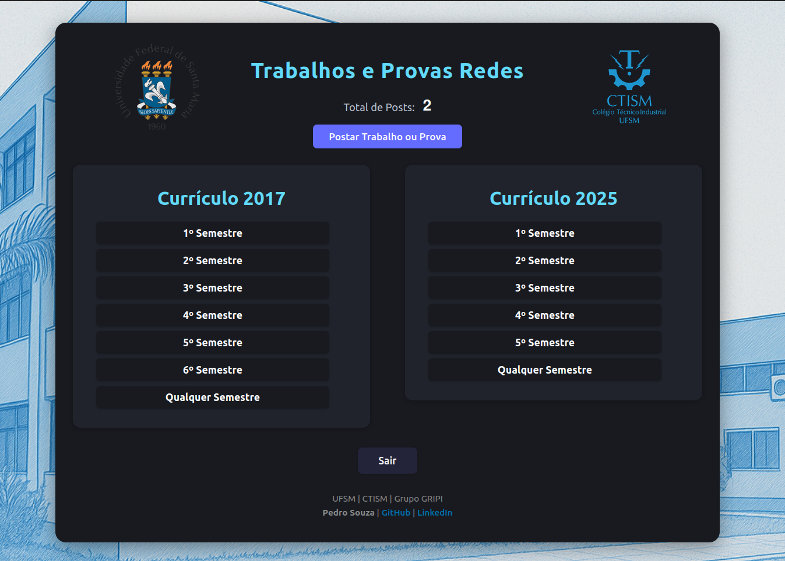

# Projeto TeP Redes - Trabalhos e Provas

<p align="center">
  
  
</p>
<p align="center">
  
  
</p>
<p align="center">
  
  
</p>

Este projeto é em uma plataforma para compartilhamento de trabalhos e provas das disciplinas do curso de Redes de Computadores. (Node.js com Express) + (React com Vite).

## Estrutura do Projeto

O projeto está dividido em duas pastas principais:

*   `tepredes-back/` Backend.
*   `trabalhoseprovasredes/` Frontend.

## Backend (`tepredes-back/`)

O backend é responsável pela lógica de negócios, autenticação, gerenciamento de dados e API para o frontend.

### Tecnologias Utilizadas (Backend)

*   Node.js
*   Express.js
*   Prisma (ORM para interagir com o banco de dados MongoDB)
*   MongoDB (Banco de dados NoSQL)
*   JSON Web Tokens (JWT) para autenticação
*   Bcrypt para hashing de senhas
*   Nodemailer para envio de e-mails (verificação de conta, recuperação de senha)
*   Winston para logging
*   Multer para upload de arquivos (PDFs)
*   Express Rate Limit para limitar requisições

### Endpoints da API (`tepredes-back/routes/apiRoutes.js`)

As rotas da API são definidas em [`tepredes-back/routes/apiRoutes.js`](tepredes-back/routes/apiRoutes.js).

#### Rotas Públicas

*   `POST /api/cadastro`: Registra um novo usuário. ([`registerUserController`](tepredes-back/controllers/userController.js#L8-L58))
*   `POST /api/login`: Autentica um usuário existente. ([`loginUserController`](tepredes-back/controllers/userController.js#L60-L100))
*   `POST /api/verificar-codigo`: Verifica o código enviado por e-mail para ativação da conta. ([`verifyUserCodeController`](tepredes-back/controllers/userController.js#L102-L114))
*   `POST /api/esqueci-senha`: Envia um código de redefinição de senha para o e-mail do usuário. ([`sendPasswordResetCodeController`](tepredes-back/controllers/userController.js#L116-L126))
*   `POST /api/resetar-senha`: Redefine a senha do usuário utilizando o código de verificação. ([`resetPasswordController`](tepredes-back/controllers/userController.js#L128-L150))
*   `POST /api/admin/login`: Autentica um administrador. ([`loginAdminController`](tepredes-back/controllers/adminController.js#L39-L103))
*   `GET /api/arquivo-download/:id`: Permite o download de um arquivo PDF utilizando um token temporário (gerado pela rota `/api/arquivo-temp/:id`). ([`baixarArquivoComTokenController`](tepredes-back/controllers/arquivoController.js#L20-L37))


### Scripts (`tepredes-back/scripts/`)

O backend inclui scripts para tarefas específicas:

*   **[`admin.js`](tepredes-back/scripts/admin.js):** Este script é utilizado para criar um usuário administrador e um usuário de teste no banco de dados.
    *   **Usuário Admin Padrão:**
        *   Nome: Admin
        *   Email: admin@admin.com
        *   Senha: admin
    *   **Usuário de Teste Padrão:**
        *   Nome: Teste
        *   Email: teste@teste.com
        *   Senha: senha123
        *   Status: ativo
    Para executar o script, navegue até o diretório `tepredes-back/` e rode o comando:
    ```sh
    node scripts/admin.js
    ```

#### Rotas Protegidas

O acesso a certas rotas requer autenticação via JWT. Os middlewares de autenticação são:

*   [`auth.js`](tepredes-back/middlewares/auth.js): Para usuários autenticados.
*   [`authAdmin.js`](tepredes-back/middlewares/authAdmin.js): Para administradores autenticados.
*   [`authUserOrAdmin.js`](tepredes-back/middlewares/authUserOrAdmin.js): Para usuários ou administradores autenticados.

**Rotas protegidas por `auth` (usuário):**

*   `GET /api/posts/ativos`: Lista todos os posts ativos. ([`getActivePostsController`](tepredes-back/controllers/postController.js#L100-L107))
*   `GET /api/posts/ativos/:disciplina`: Lista posts ativos filtrados por disciplina. ([`getActivePostsByDisciplinaController`](tepredes-back/controllers/postController.js#L109-L122))
*   `POST /api/post`: Cria um novo post (requer upload de PDF). ([`createPostController`](tepredes-back/controllers/postController.js#L7-L68))
*   `POST /api/upload`: Faz upload de um arquivo PDF (usado internamente ou para testes). ([`uploadFileController`](tepredes-back/controllers/uploadController.js#L3-L23))

**Rotas protegidas por `authAdmin` (administrador):**

*   `POST /api/admin/criar`: Cria um novo administrador. ([`createAdminController`](tepredes-back/controllers/adminController.js#L9-L37))
*   `GET /api/admin/posts`: Lista todos os posts (ativos, pendentes, recusados). ([`getAllPostsController`](tepredes-back/controllers/postController.js#L89-L98))
*   `GET /api/admin/postsPendentes`: Lista todos os posts com status pendente. ([`getPendingPostsController`](tepredes-back/controllers/postController.js#L124-L131))
*   `PATCH /api/admin/usuarios/:id/aprovar`: Aprova ou recusa o cadastro de um usuário. ([`approveOrRejectUserController`](tepredes-back/controllers/adminController.js#L105-L117))
*   `PATCH /api/admin/post/:id/aprovar`: Aprova ou recusa um post. ([`approveOrRejectPostController`](tepredes-back/controllers/postController.js#L70-L87))
*   `GET /api/admin/usuarios`: Lista todos os usuários. ([`listAllUsersController`](tepredes-back/controllers/userController.js#L153-L160))
*   `GET /api/admin/usuariosPendentes`: Lista usuários com cadastro pendente. ([`listPendingUsersController`](tepredes-back/controllers/userController.js#L162-L169))
*   `PATCH /api/admin/:id/redefinir-senha`: Redefine a senha de um administrador. ([`redefinirSenhaAdminController`](tepredes-back/controllers/adminController.js#L119-L144))

**Rotas protegidas por `authUserOrAdmin` (usuário ou administrador):**

*   `GET /api/contarUsuariosAtivos`: Retorna a contagem de usuários ativos. ([`countActiveUsersController`](tepredes-back/controllers/userController.js#L171-L178))
*   `GET /api/contarPostsAtivos`: Retorna a contagem de posts ativos. ([`countActivePostsController`](tepredes-back/controllers/userController.js#L180-L187))
*   `GET /api/arquivo-temp/:id`: Gera um link temporário (com token JWT) para visualização/download de um arquivo PDF. ([`gerarLinkTemporarioController`](tepredes-back/controllers/arquivoController.js#L7-L18))

### Rate Limiting

Para prevenir abuso e ataques de força bruta, algumas rotas possuem limite de requisições por IP ou email em uma determinada janela de tempo. Isso é implementado usando `express-rate-limit` e configurado em [`tepredes-back/middlewares/rateLimiter.js`](tepredes-back/middlewares/rateLimiter.js).

As seguintes rotas são protegidas por rate limiting:

*   `POST /api/login` e `POST /api/admin/login` (controlador: [`loginLimiter`](tepredes-back/middlewares/rateLimiter.js))
*   `POST /api/cadastro` (controlador: [`cadastroLimiter`](tepredes-back/middlewares/rateLimiter.js))
*   `POST /api/esqueci-senha` (controladores: [`resetSenhaLimiter`](tepredes-back/middlewares/rateLimiter.js), [`resetSenhaEmailLimiter`](tepredes-back/middlewares/rateLimiter.js))
*   `POST /api/upload` (controlador: [`uploadLimiter`](tepredes-back/middlewares/rateLimiter.js))
*   `POST /api/post` (controlador: [`postLimiter`](tepredes-back/middlewares/rateLimiter.js))

### Sistema de Logs

O backend utiliza a biblioteca Winston para um sistema de logging. Os logs são configurados em:

*   [`tepredes-back/logger.js`](tepredes-back/logger.js): Logger geral para a aplicação.
*   [`tepredes-back/loggerLogin.js`](tepredes-back/loggerLogin.js): Logger específico para eventos de login.

Os logs são exibidos no console e também **salvos no MongoDB** através do módulo [`tepredes-back/loggMongo.js`](tepredes-back/loggMongo.js), utilizando o schema definido em [`tepredes-back/models/log.model.js`](tepredes-back/models/log.model.js).

**Eventos logados:**

*   **Cadastro de Usuário:** Sucesso ([`userController.js`](tepredes-back/controllers/userController.js#L33-L41)) e Erro ([`userController.js`](tepredes-back/controllers/userController.js#L45-L56)).
*   **Login de Usuário:** Sucesso ([`userController.js`](tepredes-back/controllers/userController.js#L86-L96)).
*   **Criação de Post:** Sucesso ([`postController.js`](tepredes-back/controllers/postController.js#L33-L48)) e Erro ([`postController.js`](tepredes-back/controllers/postController.js#L50-L66)).
*   **Criação de Admin:** Sucesso ([`adminController.js`](tepredes-back/controllers/adminController.js#L24-L33)).
*   **Login de Admin:** Tentativas sem credenciais ([`adminController.js`](tepredes-back/controllers/adminController.js#L44-L52)), e-mail não cadastrado ([`adminController.js`](tepredes-back/controllers/adminController.js#L58-L66)), senha incorreta ([`adminController.js`](tepredes-back/controllers/adminController.js#L67-L75)), sucesso ([`adminController.js`](tepredes-back/controllers/adminController.js#L76-L87)) e erro no servidor ([`adminController.js`](tepredes-back/controllers/adminController.js#L89-L101)).
*   **Redefinição de Senha de Admin:** Sucesso ([`adminController.js`](tepredes-back/controllers/adminController.js#L130-L139)).
*   **Redefinição de Senha de Usuário:** Sucesso ([`userController.js`](tepredes-back/controllers/userController.js#L130-L140)).

**Informações registradas nos logs:**

*   `message`: Descrição do evento.
*   `nome`: Nome do usuário/admin (quando aplicável).
*   `email`: Email do usuário/admin (quando aplicável).
*   `hostname`: Hostname da requisição.
*   `ip`: Endereço IP do cliente (considerando `x-forwarded-for`).
*   `method`: Método HTTP da requisição.
*   `url`: URL original da requisição.
*   `timestamp`: Data e hora do evento.
*   `level`: Nível do log (info, error, warn).
*   `error`: Detalhes do erro (quando aplicável).

## Frontend (`trabalhoseprovasredes/`)

O frontend é feito com React e Vite.

### Tecnologias Utilizadas (Frontend)

*   React
*   Vite
*   React Router DOM para navegação
*   CSS para estilização

### Principais Páginas e Funcionalidades (Frontend)

*   **Login/Cadastro:** Páginas para autenticação e registro de usuários ([`src/pages/Login/index.jsx`](trabalhoseprovasredes/src/pages/Login/index.jsx), [`src/pages/Cadastro/index.jsx`](trabalhoseprovasredes/src/pages/Cadastro/index.jsx)).
*   **Verificação de Código:** Página para inserir o código de verificação após o cadastro ([`src/pages/Cadastro/verificar-codigo.jsx`](trabalhoseprovasredes/src/pages/Cadastro/verificar-codigo.jsx)).
*   **Recuperação de Senha:** Fluxo para redefinição de senha ([`src/pages/Login/esquecisenha.jsx`](trabalhoseprovasredes/src/pages/Login/esquecisenha.jsx), [`src/pages/Login/validarcodigo.jsx`](trabalhoseprovasredes/src/pages/Login/validarcodigo.jsx), [`src/pages/Login/resetarsenha.jsx`](trabalhoseprovasredes/src/pages/Login/resetarsenha.jsx)).
*   **Home:** Página principal após o login, exibe matrizes curriculares e total de posts ([`src/pages/Home/index.jsx`](trabalhoseprovasredes/src/pages/Home/index.jsx)).
*   **Posts Ativos:** Visualização de trabalhos e provas por disciplina ([`src/pages/PostsAtivos/index.jsx`](trabalhoseprovasredes/src/pages/PostsAtivos/index.jsx)).
*   **Postar:** Formulário para submissão de novos trabalhos/provas ([`src/pages/Post/index.jsx`](trabalhoseprovasredes/src/pages/Post/index.jsx)).
*   **Visualizar PDF:** Componente para exibir PDFs diretamente no navegador ([`src/pages/VerPDF/index.jsx`](trabalhoseprovasredes/src/pages/VerPDF/index.jsx)).
*   **Páginas de Admin:** Interface para gerenciamento de usuários e posts (ex: [`src/pages/AdminHome/index.jsx`](trabalhoseprovasredes/src/pages/AdminHome/index.jsx), [`src/pages/AdminNovo/index.jsx`](trabalhoseprovasredes/src/pages/AdminNovo/index.jsx)).
*   **NotFound:** Página para rotas não encontradas ([`src/pages/NotFound.jsx`](trabalhoseprovasredes/src/pages/NotFound.jsx)).

O roteamento no frontend é gerenciado pelo [`src/App.jsx`](trabalhoseprovasredes/src/App.jsx), que define rotas públicas, privadas para usuários (`PrivateRoute`), privadas para administradores (`AdminPrivateRoute`) e privadas para usuários ou administradores (`UserOrAdminPrivateRoute`).

### Configuração e Instalação (Backend)

1.  Navegue até o diretório `tepredes-back/`.
2.  Crie um arquivo `.env` baseado no exemplo abaixo e preencha com suas credenciais:
    ```env
    # filepath: tepredes-back/.env
    JWT_SECRET="sua_chave_secreta_jwt"
    DATABASE_URL="sua_string_de_conexao_mongodb"
    GMAIL_USER="seu_email_gmail_para_envio"
    GMAIL_PASS="sua_senha_de_app_gmail"
    PORT=3000
    API_URL="http://localhost:3000" # Ou o URL de sua escolha.
    ```
3.  Instale as dependências:
    ```sh
    npm install
    ```
4.  Execute o servidor:
    ```sh
    npm start
    ```
    O servidor estará rodando em `http://localhost:3000` (ou a porta definida em `.env`).

### Configuração e Instalação (Frontend)

1.  Navegue até o diretório `trabalhoseprovasredes/`.
2.  Crie um arquivo `.env` na raiz do frontend e configure a URL da API do backend:
    ```env
    # filepath: trabalhoseprovasredes/.env
    VITE_API_URL=http://localhost:3000/api # Ou a URL de sua escolha.
    ```
3.  Instale as dependências:
    ```sh
    npm install
    ```
4.  Inicie o servidor de desenvolvimento:
    ```sh
    npm run dev
    ```
    A aplicação estará acessível em `http://localhost:5173` (ou a porta configurada em [`trabalhoseprovasredes/vite.config.js`](trabalhoseprovasredes/vite.config.js)).

O sistema está disponível em: `https://trabalhoseprovasredes.onrender.com` porém apenas disponível para email do curso @redes